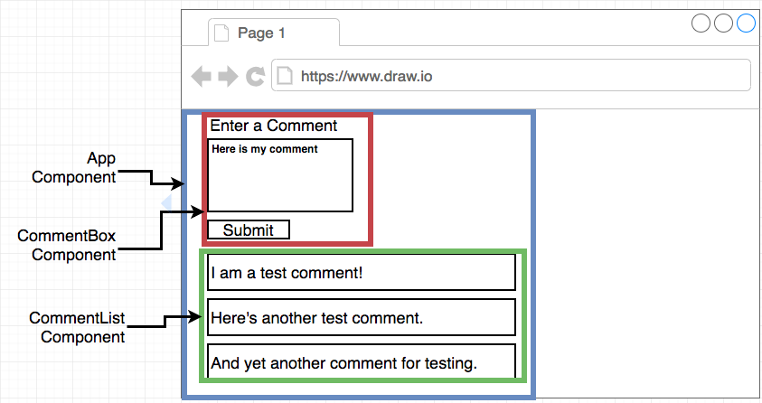
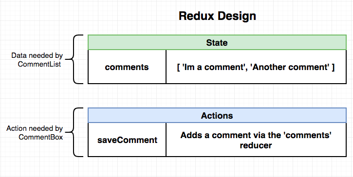
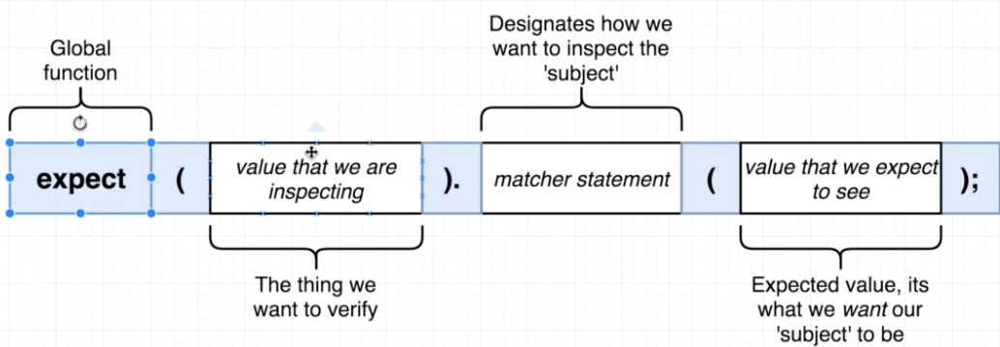
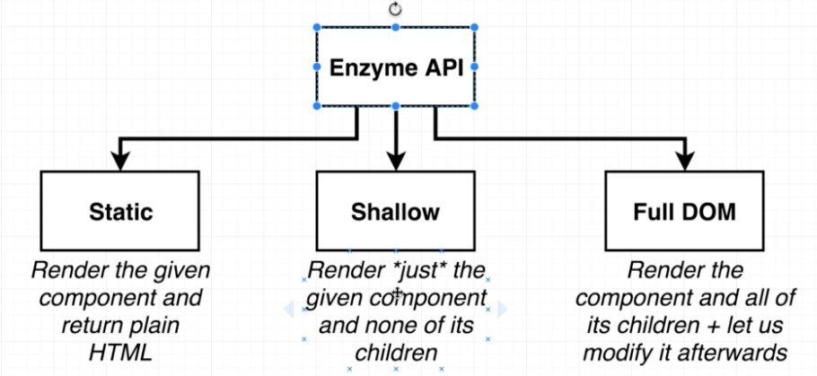

## React Application Test Use Jest

### 应用流程图

### reduex 设计

### 需要测试的组件和功能

1.  App Component

| App Component                       |
| ----------------------------------- |
| Shows the Comment Box inside of it  |
| Shows the Comment List inside of it |

2.  CommentBox Component

| CommentBox Component                                     |
| -------------------------------------------------------- |
| Shows a text area and a button                           |
| Users can enter input into the text area                 |
| When the input is submitted, textarea should get emptied |

3.  CommentList Component

| CommentList Component              |
| ---------------------------------- |
| Shows one 'li' element per comment |
| Text from each comment is visible  |

4.  Comments Reducer

| Comments Reducer                                                |
| --------------------------------------------------------------- |
| Properly hands actions with a type of 'SAVE_COMMENT'            |
| Doesn't throw an error if it gets an action with any other type |

5.  SaveComment Action

| SaveComment Action                                              |
| --------------------------------------------------------------- |
| Has a type of 'SAVE_COMMENT'                                    |
| Produces an action that has a payload of the new comment's text |

### 基本测试语法

### enzyme 设计

